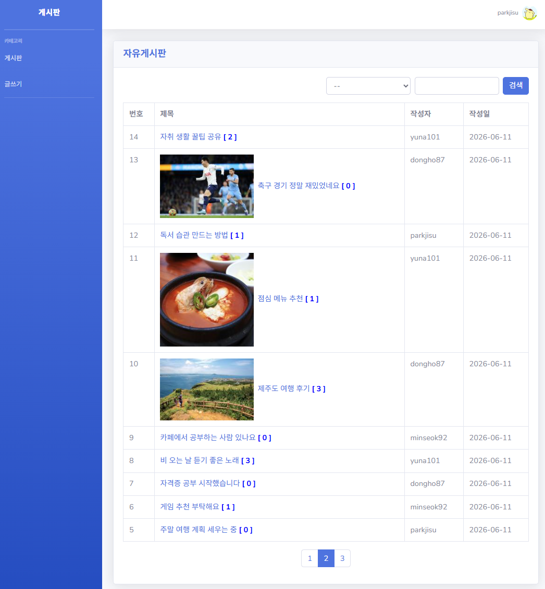
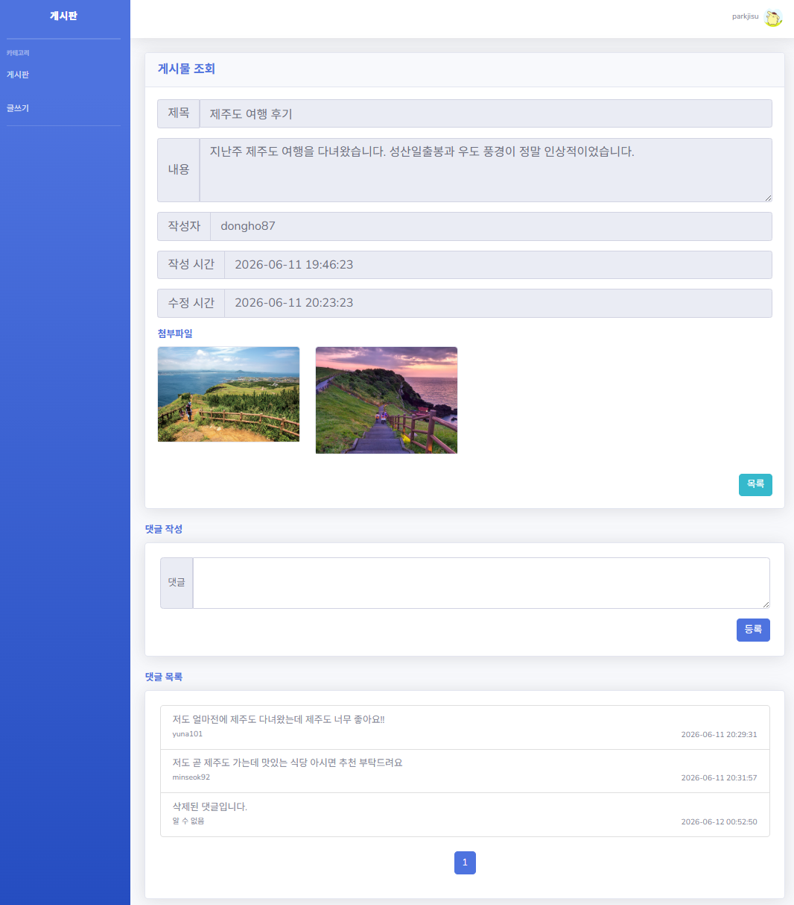
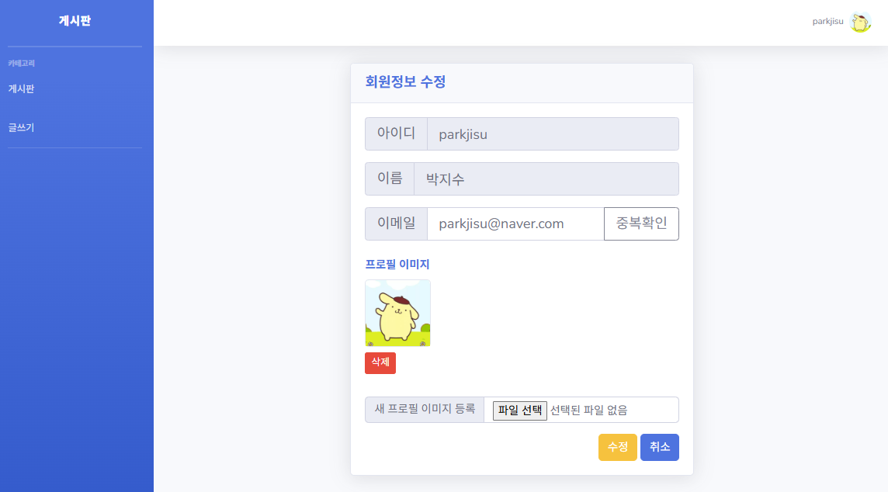
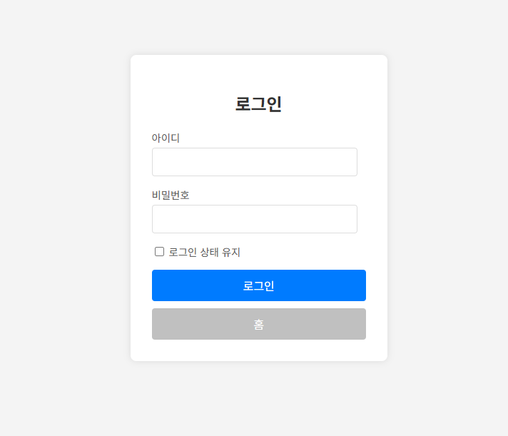

# 📋 Spring Legacy 자유게시판

Spring Legacy + MyBatis + Spring Security 기반의 자유게시판 프로젝트입니다.
SI 취업을 위한 포트폴리오 목적으로 제작하였으며, 실무에서 사용되는 레거시 환경을 직접 구성하고 구현했습니다.

## 🛠 기술 스택
| 분류 | 기술 |
|------|------|
| Backend | Java 17, Spring MVC (Legacy), MyBatis |
| Frontend | JSP, JSTL, Bootstrap, Axios |
| Security | Spring Security |
| DB | MariaDB |
| Server | Apache Tomcat 10.1 |
| Build | Maven |

## 📁 패키지 구조
```
org.oolong
├── common.util       # FileUploader 등 공통 유틸
├── config            # Jackson 등 설정
├── controller
│   ├── advice        # ViewControllerAdvice, ApiControllerAdvice
│   ├── api           # Ajax 처리 (AccountApiController, CommentController)
│   └── view          # SSR 처리 (BoardController, AccountController 등)
├── dto               # DTO 클래스
├── mapper            # MyBatis Mapper 인터페이스
├── security          # Spring Security 설정 및 핸들러
├── service           # 비즈니스 로직
└── service.exception # 커스텀 예외
```

## ✅ 주요 기능
### 게시물
- 게시물 CRUD (첨부파일 포함)
- 이미지 파일 썸네일 자동 생성
- 페이징 및 검색 (제목 / 내용 / 작성자)
- 작성자 및 관리자 권한 기반 수정/삭제
- 소프트딜리트 적용

### 댓글
- 댓글 CRUD (Ajax)
- 댓글 페이징
- 소프트딜리트 적용 ("삭제된 댓글입니다." 표시)

### 회원
- 회원가입 / 로그인 / 로그아웃
- 프로필 이미지 등록 / 수정 / 삭제
- 회원정보 수정 / 비밀번호 변경 / 회원탈퇴
- Remember-Me (DB 기반 영속 로그인)
- 소프트딜리트 적용

### 보안
* Spring Security 기반 인증/인가
* CSRF 보호

### 예외 처리
- `ApplicationException` 커스텀 예외 클래스로 에러 코드 관리
- SSR 요청: `ViewControllerAdvice`에서 플래시 어트리뷰트로 에러 메시지 전달 후 alert 처리
- Ajax 요청: `ApiControllerAdvice`에서 에러 메시지 반환 후 alert 처리

### 에러 페이지
- 403 / 404 / 500 커스텀 에러 페이지 구성

## 🗄 DB 설정
MariaDB 사용, `src/main/resources` 경로에 DDL 파일(schema.sql) 있습니다.

## 🖥 실행 방법
1. MariaDB에 DDL 실행
2. db.properties DB 접속 정보 입력
3. Tomcat 10.1 서버에 배포 후 실행

## 📝 트러블슈팅 기록
개발 중 겪은 문제와 해결 과정을 별도 저장소에 스터디로그로 정리했습니다. <br>
👉 [스터디로그 바로가기](https://github.com/yrpark33/study-log)

## 📸 실행 화면

### 게시물 목록


### 게시물 상세


### 회원정보 수정


### 로그인

